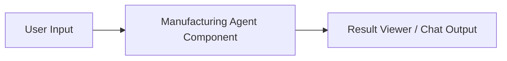
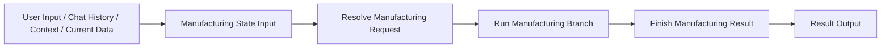
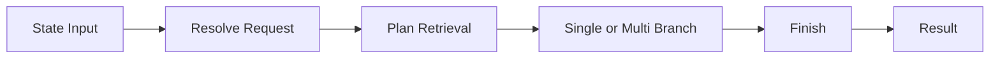

# Langflow Canvas Example

이 문서는 Langflow에서 이 프로젝트를 어떤 식으로 연결하면 되는지 예시로 보여줍니다.

## 가장 단순한 방식

하나의 컴포넌트만 쓰는 방식입니다.

언제 쓰면 좋은가:

- 먼저 기능이 되는지 빨리 확인하고 싶을 때
- 캔버스를 단순하게 유지하고 싶을 때

장점:

- 연결이 가장 쉽습니다.
- 내부 흐름은 모두 코어 로직이 처리합니다.

단점:

- 중간 상태를 보기 어렵습니다.
- 어느 단계에서 분기되었는지 확인하기 어렵습니다.

## 권장 방식

단계별로 나누어 연결하는 방식입니다.

언제 쓰면 좋은가:

- 구조를 이해하면서 붙이고 싶을 때
- 디버깅이 중요할 때
- 나중에 custom node를 더 세분화할 계획이 있을 때

## 각 컴포넌트 역할

### [ManufacturingStateComponent](/C:/Users/qkekt/Desktop/agent_langgraph_v2/langflow_version/components.py)
- 사용자 입력을 공통 state 딕셔너리로 만듭니다.

### [ResolveRequestComponent](/C:/Users/qkekt/Desktop/agent_langgraph_v2/langflow_version/components.py)
- 파라미터를 추출하고 query mode 를 결정합니다.
- 결과적으로 “새 데이터 조회인지” 또는 “현재 테이블 재분석인지”가 여기서 정해집니다.

### [RunWorkflowBranchComponent](/C:/Users/qkekt/Desktop/agent_langgraph_v2/langflow_version/components.py)
- 현재 state 를 보고 필요한 다음 branch 를 실행합니다.
- 내부적으로는 follow-up analysis, single retrieval, multi retrieval 중 하나를 수행합니다.

### [FinishManufacturingResultComponent](/C:/Users/qkekt/Desktop/agent_langgraph_v2/langflow_version/components.py)
- 결과를 정리합니다.
- `state` 와 `result` 를 함께 꺼낼 수 있습니다.

## 더 세밀하게 나누고 싶을 때

지금 코드 기준으로는 다음처럼 세분화가 가능합니다.

현재 제공 컴포넌트 기준으로 바로 쓸 수 있는 조합:

1. `Manufacturing State Input`
2. `Resolve Manufacturing Request`
3. `Plan Manufacturing Retrieval`
4. `Run Manufacturing Branch`
5. `Finish Manufacturing Result`

주의:

- 현재 `Run Manufacturing Branch` 는 내부에서 branch 를 한 번 더 판단합니다.
- 따라서 `Plan Manufacturing Retrieval` 를 생략해도 동작하지만, 중간 계획 값을 눈으로 보고 싶다면 넣는 것이 좋습니다.

## 입력 예시

### `Manufacturing State Input`

- `user_input`
  - 예: `오늘 DA 공정 DDR5 제품 WIP 보여줘`
- `chat_history`
  - 예: `[]`
- `context`
  - 예: `{}`
- `current_data`
  - 예: `null`

## 출력에서 보면 좋은 필드

### 중간 state 에서 보기 좋은 값

- `extracted_params`
- `query_mode`
- `retrieval_plan`
- `retrieval_jobs`

### 최종 result 에서 보기 좋은 값

- `response`
- `tool_results`
- `current_data`
- `execution_engine`

## 추천 디버깅 순서

1. `Resolve Manufacturing Request` 뒤에서 `query_mode` 확인
2. `Plan Manufacturing Retrieval` 뒤에서 `retrieval_plan.dataset_keys` 확인
3. `Finish Manufacturing Result` 뒤에서 `tool_results` 확인
4. 기대와 다르면 같은 입력으로 LangGraph 버전 결과와 비교

## 참고 파일

- [langflow_version/workflow.py](/C:/Users/qkekt/Desktop/agent_langgraph_v2/langflow_version/workflow.py)
- [langflow_version/components.py](/C:/Users/qkekt/Desktop/agent_langgraph_v2/langflow_version/components.py)
- [docs/LANGFLOW_VERSION.md](/C:/Users/qkekt/Desktop/agent_langgraph_v2/docs/LANGFLOW_VERSION.md)
