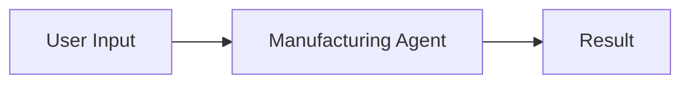
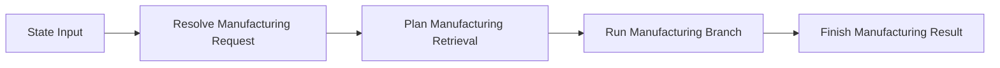
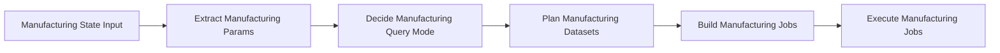

# Langflow Canvas Example

## 1. 가장 쉬운 방식

하나의 노드로 전체를 실행합니다.

추천 상황:
- 일단 동작만 빨리 확인하고 싶을 때
- 질문 몇 개로 스모크 테스트를 하고 싶을 때

## 2. 큰 단계 노드 방식

추천 상황:
- 그래프 흐름을 크게 보고 싶을 때
- resolve / plan / branch 단계별로 확인하고 싶을 때

## 3. 잘게 쪼갠 방식

추천 상황:
- 어느 단계에서 로직을 바꾸고 싶은지 명확할 때
- Langflow에서 재배치/치환을 자주 할 때
- 중간 결과를 세밀하게 확인하고 싶을 때

## 단계별 연결 예시

### 조회 흐름
- `Manufacturing State Input.initial_state` -> `Extract Manufacturing Params.state`
- `Extract Manufacturing Params.state_with_params` -> `Decide Manufacturing Query Mode.state`
- `Decide Manufacturing Query Mode.state_with_mode` -> `Plan Manufacturing Datasets.state`
- `Plan Manufacturing Datasets.state_with_plan` -> `Build Manufacturing Jobs.state`
- `Build Manufacturing Jobs.state_with_jobs` -> `Execute Manufacturing Jobs.state`

### 후속 분석 흐름
- `Manufacturing State Input.initial_state` -> `Extract Manufacturing Params.state`
- `Extract Manufacturing Params.state_with_params` -> `Run Manufacturing Followup.state`

## 첫 테스트 질문

- `오늘 DA공정 생산량 알려줘`
- `오늘 WB공정에서 생산 달성율을 MODE별로 알려줘`
- `오늘 DA공정에서 DDR5제품의 생산 달성율을 공정별로 알려줘`
