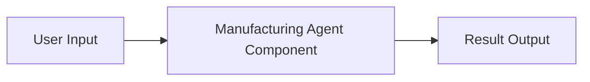
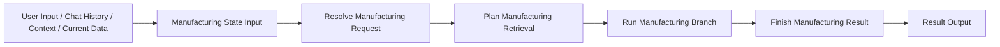

# Langflow Canvas Example

이 문서는 Langflow에서 이 프로젝트를 어떤 식으로 연결하면 좋은지 예시를 보여줍니다.

## 가장 단순한 방식

하나의 컴포넌트만 쓰는 방법입니다.



이 방식이 좋은 경우:

- 먼저 전체 기능이 도는지만 확인하고 싶을 때
- 캔버스를 최대한 단순하게 유지하고 싶을 때

## 권장 방식

단계별로 나누어 연결하는 방법입니다.



이 방식이 좋은 경우:

- 중간 상태를 확인하고 싶을 때
- 나중에 custom node를 더 세분화할 계획이 있을 때

## 각 컴포넌트 역할

### [ManufacturingStateComponent](/C:/Users/qkekt/Desktop/agent_langgraph_v2/langflow_version/components.py)
- 사용자 입력을 공통 state로 묶습니다.

### [ResolveRequestComponent](/C:/Users/qkekt/Desktop/agent_langgraph_v2/langflow_version/components.py)
- 파라미터를 추출하고 query mode를 결정합니다.

### [PlanRetrievalComponent](/C:/Users/qkekt/Desktop/agent_langgraph_v2/langflow_version/components.py)
- 필요한 dataset과 retrieval job을 만듭니다.

### [RunWorkflowBranchComponent](/C:/Users/qkekt/Desktop/agent_langgraph_v2/langflow_version/components.py)
- 현재 state를 보고 follow-up, single retrieval, multi retrieval 중 하나를 실행합니다.

### [FinishManufacturingResultComponent](/C:/Users/qkekt/Desktop/agent_langgraph_v2/langflow_version/components.py)
- 결과를 정리하고 최종 `result`를 꺼냅니다.

## 입력 예시

- `user_input`
  - 예: `오늘 DA 공정 DDR5 제품 WIP 보여줘`
- `chat_history`
  - 예: `[]`
- `context`
  - 예: `{}`
- `current_data`
  - 예: `null`

## 확인하면 좋은 값

### state에서 보기 좋은 값

- `extracted_params`
- `query_mode`
- `retrieval_plan`
- `retrieval_jobs`

### result에서 보기 좋은 값

- `response`
- `tool_results`
- `current_data`
- `execution_engine`

## 추천 디버깅 순서

1. `Resolve Manufacturing Request`에서 `query_mode` 확인
2. `Plan Manufacturing Retrieval`에서 `retrieval_plan.dataset_keys` 확인
3. `Finish Manufacturing Result`에서 `tool_results` 확인
4. 같은 질문으로 LangGraph 버전 결과와 비교
## 실제 로딩 경로

Langflow에서 커스텀 컴포넌트를 자동으로 보이게 하려면 아래 폴더를 `LANGFLOW_COMPONENTS_PATH` 로 설정합니다.

```powershell
$env:LANGFLOW_COMPONENTS_PATH="C:\Users\qkekt\Desktop\agent_langgraph_v2\langflow_components"
```

Langflow가 직접 읽는 파일:

- [manufacturing_agent_component.py](/C:/Users/qkekt/Desktop/agent_langgraph_v2/langflow_components/manufacturing_agent/manufacturing_agent_component.py)
- [manufacturing_state_input.py](/C:/Users/qkekt/Desktop/agent_langgraph_v2/langflow_components/manufacturing_agent/manufacturing_state_input.py)
- [resolve_manufacturing_request.py](/C:/Users/qkekt/Desktop/agent_langgraph_v2/langflow_components/manufacturing_agent/resolve_manufacturing_request.py)
- [plan_manufacturing_retrieval.py](/C:/Users/qkekt/Desktop/agent_langgraph_v2/langflow_components/manufacturing_agent/plan_manufacturing_retrieval.py)
- [run_manufacturing_branch.py](/C:/Users/qkekt/Desktop/agent_langgraph_v2/langflow_components/manufacturing_agent/run_manufacturing_branch.py)
- [finish_manufacturing_result.py](/C:/Users/qkekt/Desktop/agent_langgraph_v2/langflow_components/manufacturing_agent/finish_manufacturing_result.py)

이 파일은 저장소 루트를 import path에 추가한 뒤,
아래 실제 컴포넌트 구현을 다시 노출하는 역할만 합니다.

- [components.py](/C:/Users/qkekt/Desktop/agent_langgraph_v2/langflow_version/components.py)
