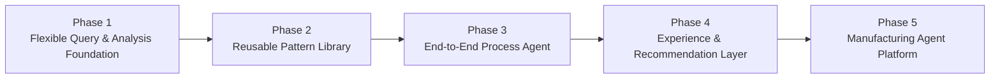
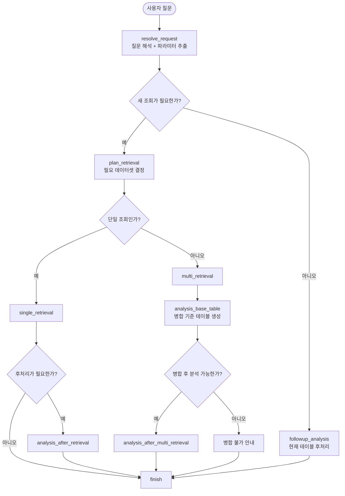
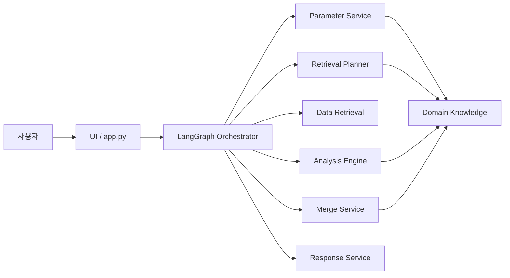
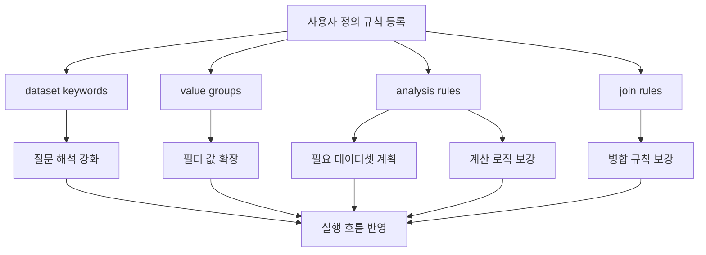
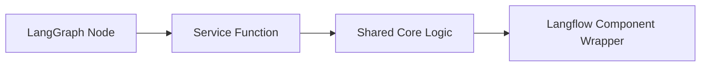

# Manufacturing Agent Diagrams

이 문서는 제조 에이전트의 현재 구조와 앞으로 확장하려는 방향을 발표 자료나 설계 리뷰에서 바로 설명할 수 있도록 정리한 다이어그램 모음입니다.

## 1. 전체 발전 방향

핵심 메시지:
- 현재 구현은 `Phase 1`에 해당합니다.
- 지금 구조는 이후 패턴형 업무 자동화와 공정별 에이전트 확장을 위한 기반입니다.

## 2. 현재 LangGraph 흐름

핵심 메시지:
- 먼저 `재조회`와 `현재 테이블 후처리`를 나눕니다.
- 재조회가 필요하면 다시 `단일`과 `다중` 흐름으로 분기합니다.
- 다중 조회는 바로 분석하지 않고 병합 안전성부터 확인합니다.

## 3. 현재 아키텍처 구성

핵심 메시지:
- 그래프는 작게 유지하고, 실제 로직은 서비스 계층으로 분리했습니다.
- 도메인 지식은 파라미터 해석, 조회 계획, 병합, 분석에 공통으로 연결됩니다.

## 4. 도메인 규칙 반영 흐름

핵심 메시지:
- 등록된 규칙은 단순 메모가 아니라 실제 실행 흐름에 반영됩니다.
- 조회 계획과 분석 로직이 모두 도메인 규칙의 영향을 받습니다.

## 5. Langflow 전환 관점

핵심 메시지:
- 핵심 로직을 서비스 함수로 분리했기 때문에 Langflow 컴포넌트로 감싸기 쉽습니다.
- 장기적으로는 `그래프 조립 방식만 다르고 코어 로직은 공유`하는 구조를 목표로 합니다.
