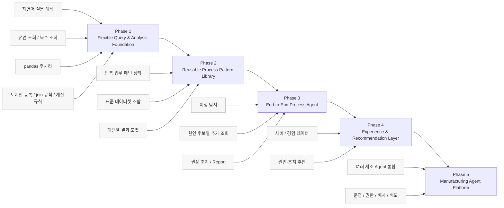
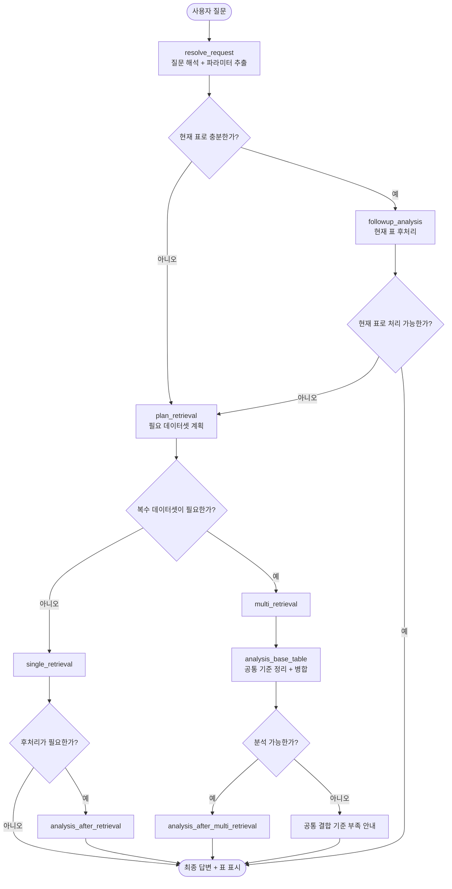
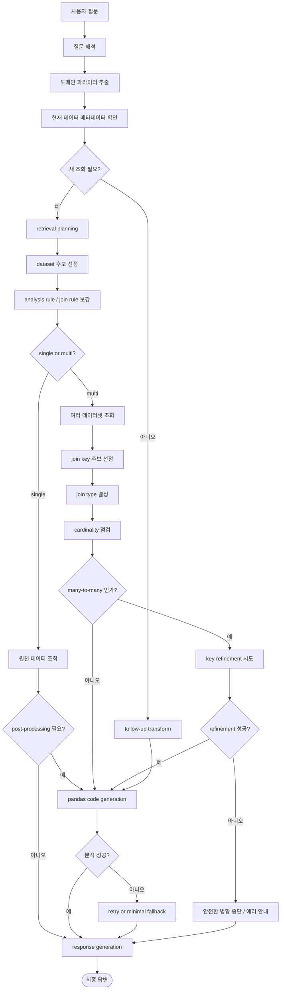
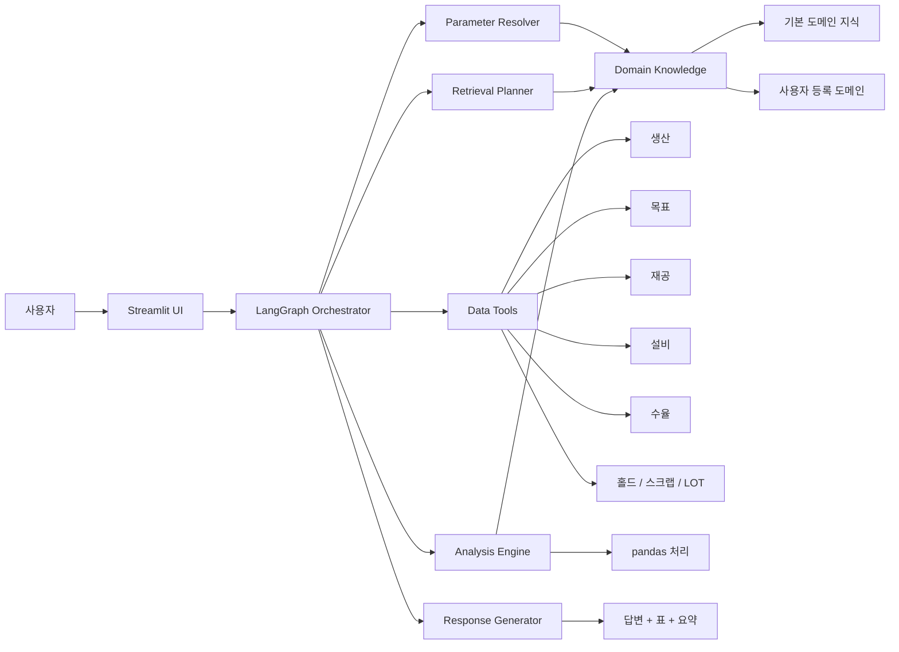
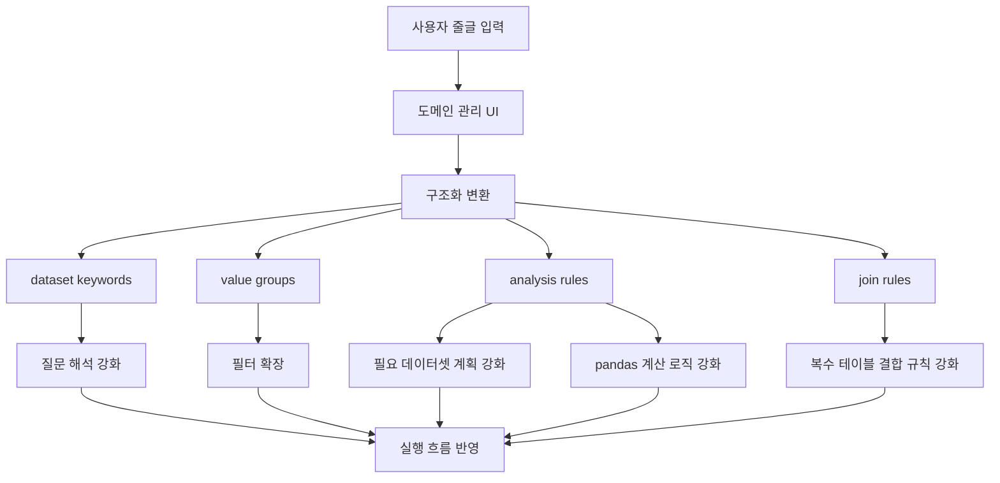
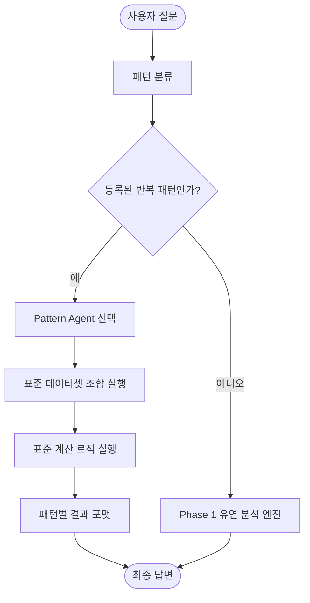
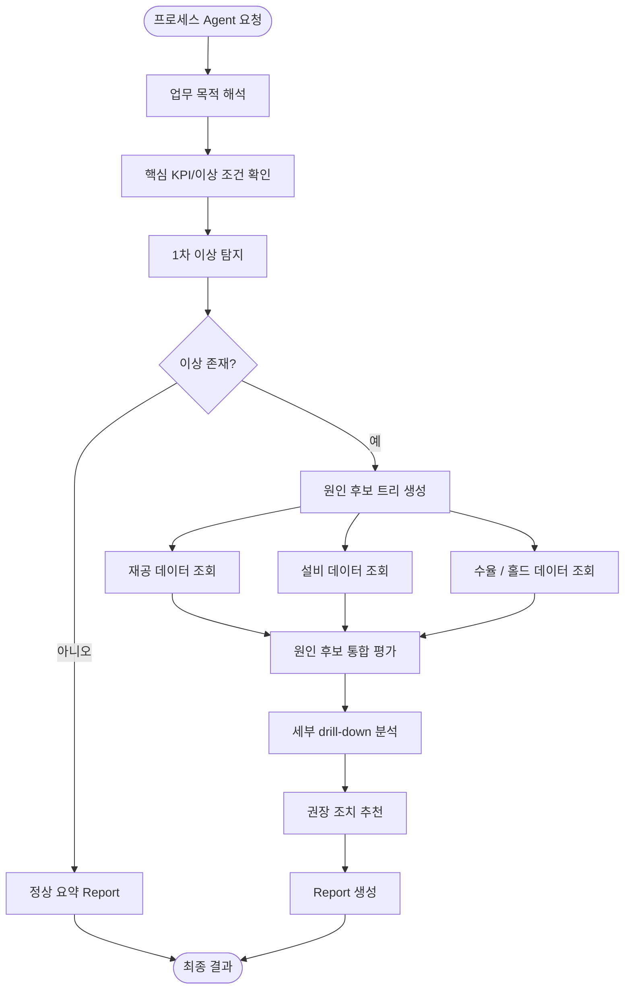
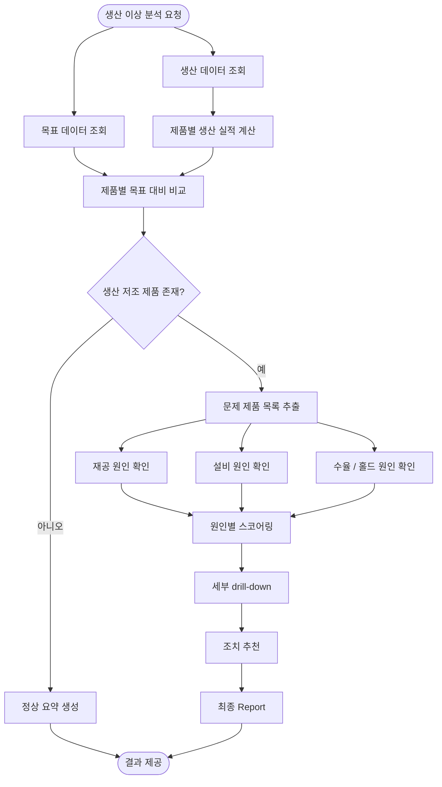
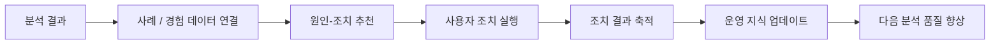

# Manufacturing Agent Diagrams

이 문서는 `PPT 장표에 바로 넣기 쉬운 실행 그래프` 중심으로 다시 정리한 문서입니다.

설계 문장보다 `노드`, `분기`, `합류`, `재시도`, `종료`가 한눈에 보이도록 구성했습니다.  
Mermaid를 그대로 붙여 넣거나, PNG/SVG로 변환해서 발표 자료에 넣는 용도로 사용할 수 있습니다.

## 1. 전체 Phase 로드맵 도식

### 장표에서 강조할 메시지

- 현재는 `Phase 1`을 구현 중입니다.
- Phase 1은 나중의 프로세스 Agent를 가능하게 만드는 기반입니다.
- 이후 Phase는 지금 만든 기반 위에 쌓아 올리는 구조입니다.

## 2. 현재 Phase 1 전체 실행 그래프

### 장표에서 강조할 메시지

- 질문은 먼저 `새 조회`와 `기존 표 재사용`으로 갈립니다.
- 새 조회로 가면 다시 `단일 조회`와 `복수 조회`로 분기됩니다.
- 복수 조회는 바로 끝나지 않고 `병합 가능성 판단` 단계를 거칩니다.
- follow-up 분석도 필요하면 다시 retrieval로 되돌아갈 수 있습니다.

## 3. 현재 Phase 1 세부 실행 그래프

### 장표에서 강조할 메시지

- 이 그림은 “실제 내부에서 어떤 판단이 이어지는지”를 보여주는 운영용 그래프입니다.
- 단순 LLM 답변이 아니라 `계획 -> 조회 -> 병합 -> 분석 -> 응답`이 단계적으로 이어집니다.

## 4. 현재 시스템 아키텍처 그래프

### 장표에서 강조할 메시지

- UI, Orchestrator, Domain, Retrieval, Analysis가 분리되어 있습니다.
- 사용자 도메인 등록은 단순 메모가 아니라 Planner와 Analysis에 직접 연결됩니다.

## 5. 도메인 지식 반영 그래프

### 장표에서 강조할 메시지

- 도메인 등록은 별도 저장만 하는 기능이 아닙니다.
- 질문 해석, 데이터 계획, 후처리, join 전략까지 실제 실행에 반영됩니다.

## 6. Phase 2 패턴 Agent 실행 그래프

### 장표에서 강조할 메시지

- Phase 2는 Phase 1을 버리는 것이 아니라, 그 위에 `패턴용 빠른 경로`를 추가하는 구조입니다.
- 반복 업무일수록 더 안정적이고 예측 가능한 실행이 가능해집니다.

## 7. Phase 3 프로세스 Agent 실행 그래프

### 장표에서 강조할 메시지

- 이 단계부터는 단순 조회가 아니라 업무 프로세스를 한 번에 수행합니다.
- 여러 하위 분석이 병렬 또는 순차로 연결되는 구조를 가집니다.

## 8. 생산 이상 분석 프로세스 Agent 상세 그래프

### 장표에서 강조할 메시지

- 이 그림은 `앞으로 구현하려는 End-to-End Agent`의 대표 예시입니다.
- 단순히 “생산이 낮다”를 보여주는 것이 아니라, 원인과 조치까지 연결합니다.

## 9. 장기 확장 그래프

### 장표에서 강조할 메시지

- 최종 목표는 “한 번 답하고 끝나는 분석기”가 아니라,
- 조직의 경험을 축적하면서 더 좋아지는 제조 Agent 플랫폼입니다.
