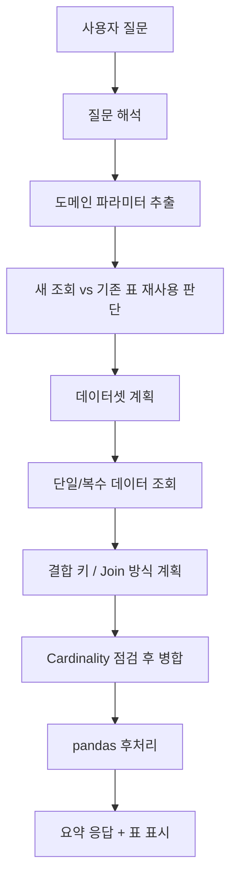
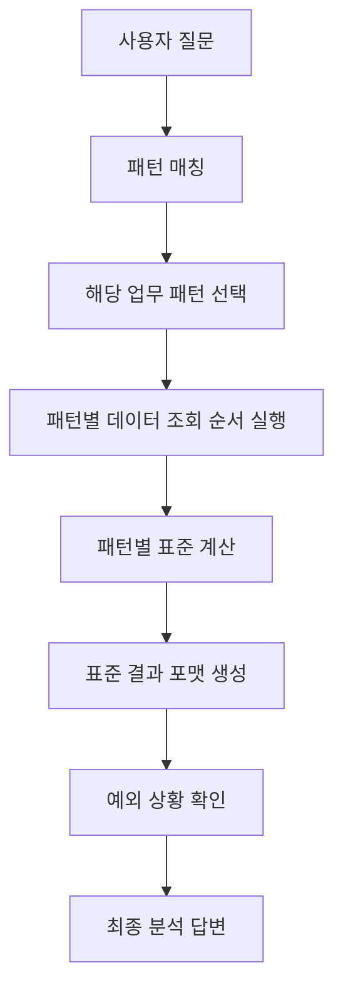
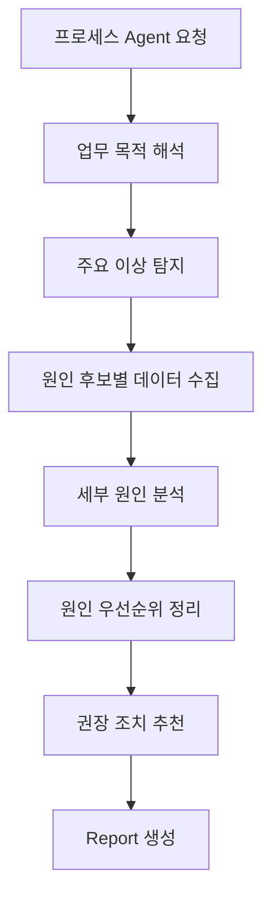
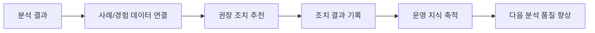

# Manufacturing Agent Roadmap

이 문서는 현재 구현된 `제조 데이터 채팅 분석` LangGraph 버전을 기준으로,

- 왜 지금 구조가 필요한지
- 현재 어디까지 구현되었는지
- 앞으로 어떤 Phase로 확장할지
- 각 Phase에서 어떤 Agent 흐름이 필요한지

를 한 번에 이해할 수 있도록 정리한 문서입니다.

이 문서의 관점에서 보면, 현재 코드는 `Phase 1`을 구현 중이라고 생각하면 됩니다.

## 1. 과제 배경

제조 업무에서는 질문 하나를 처리할 때도 정형화된 SQL 한 번으로 끝나지 않는 경우가 많습니다.

예를 들어 사용자는 이렇게 묻습니다.

- `어제 DA공정에서 DDR5제품 생산 달성률 알려줘`
- `오늘 DA공정에서 MODE별 생산량 보여줘`
- `생산 포화율과 생산 달성율을 FAMILY/MODE/DEN/TECH/LEAD 기준으로 보여줘`

이 질문들은 겉으로는 간단해 보이지만, 실제로는 아래와 같은 작업이 섞여 있습니다.

- 질문에서 도메인 속성 추출
- 공정/제품/패키지/기술 조건 해석
- 필요한 원천 데이터셋 선택
- 여러 테이블 결합
- pandas 기반 후처리
- 파생 지표 계산
- 최종 요약 답변 생성

즉, 제조 업무는 `정형 보고서`만 있는 것이 아니라 `속성 조합 기반의 가변 조회 + 후처리`가 매우 많습니다.
그래서 지금 1차 목표는, 이런 비정형 질문을 유연하게 처리할 수 있는 기반 구조를 만드는 것입니다.

## 2. 현재 제조 업무의 두 가지 성격

현재 제조 업무는 크게 두 종류로 볼 수 있습니다.

### 2.1 비정형/가변형 업무

이 유형은 아직 Flow가 완전히 고정되어 있지 않습니다.

특징:

- 질문 형태가 다양함
- 속성 조합이 계속 바뀜
- 어떤 데이터를 봐야 하는지 질문마다 달라짐
- 조회 후 후처리가 많이 필요함
- 업무를 하면서 자주 쓰는 패턴을 나중에 정형화할 수 있음

현재 구현된 LangGraph 버전은 바로 이 영역을 먼저 해결하기 위한 구조입니다.

### 2.2 정형화 가능한 End-to-End 업무

반대로 일부 업무는 흐름을 꽤 분명하게 정리할 수 있습니다.

예를 들어 생산 이상 분석은 아래처럼 하나의 프로세스로 묶을 수 있습니다.

1. 생산 데이터 조회
2. 목표 데이터 조회
3. 제품별 생산 이상 여부 탐지
4. 원인 후보 데이터 조회
   - 재공
   - 설비 가동률
   - 수율
   - 홀드
5. 이상이 발생한 지점의 상세 분석
6. 축적된 경험 데이터와 연결
7. 원인별 권장 조치/해결방안 제시
8. 최종 Report 생성

이런 업무는 나중에 `한 번에 끝까지 수행하는 프로세스 Agent`로 확장하는 것이 맞습니다.

즉, 현재 프로젝트는

- 먼저 유연한 분석 기반을 만들고
- 그 기반 위에 정형화된 프로세스 Agent를 올리는 구조

로 가는 것이 자연스럽습니다.

## 3. 전체 목표

이 제조 Agent 과제의 전체 목표는 아래와 같습니다.

### 3.1 단기 목표

자연어 질문을 받아 필요한 제조 데이터를 유연하게 조회하고, 도메인 지식과 pandas 후처리를 통해 실무자가 원하는 형태의 결과를 바로 제공하는 것

### 3.2 중기 목표

반복적으로 자주 쓰는 분석 흐름을 `프로세스 Agent` 형태로 구체화해서, 사용자가 단일 질문만 해도 여러 단계를 자동으로 수행하게 만드는 것

### 3.3 장기 목표

원인 분석, 권장 조치, 보고서 생성, 경험 데이터 축적까지 연결되는 `제조 업무 자동화 플랫폼`으로 발전시키는 것

## 4. 현재 구현 구조의 의미

현재 LangGraph 기반 구현은 “완성형 보고서 Agent”가 아니라, 그보다 앞 단계인 `유연 조회/분석 엔진`입니다.

핵심 역할은 아래와 같습니다.

- 자연어 질문 해석
- 도메인 지식 기반 파라미터 추출
- 필요한 데이터셋 계획
- 단일/복수 데이터셋 조회
- 안전한 결합
- pandas 후처리
- 요약 응답 생성
- 사용자 도메인 지식 확장

즉, 지금 코드는 `Phase 1의 기반 Agent`입니다.

## 5. Phase 전체 구상

아래처럼 단계적으로 나누는 것이 가장 현실적입니다.

### Phase 1. Flexible Query & Analysis Foundation

목표:
정형화되지 않은 제조 질문을 안정적으로 해석하고, 필요한 데이터를 유연하게 조회/분석할 수 있는 기반을 만든다.

현재 이 Phase를 구현 중입니다.

핵심 산출물:

- LangGraph 기반 질문 처리 흐름
- 도메인 지식 기반 파라미터 추출
- 복수 데이터셋 조회 및 결합
- pandas 후처리
- 파생 지표 계산
- 도메인 관리 UI
- join 규칙/분석 규칙 등록 구조

### Phase 2. Reusable Process Pattern Library

목표:
반복되는 분석 흐름을 `패턴` 또는 `미니 프로세스 Agent`로 정리한다.

예시:

- 생산 달성률 점검 Flow
- 생산 포화율 점검 Flow
- 홀드 이상 점검 Flow
- 설비/재공 복합 이상 점검 Flow
- 일자 비교 Flow

핵심 산출물:

- 업무 패턴 템플릿
- 패턴별 필요한 데이터 정의
- 패턴별 기본 분석 단계
- 패턴별 표준 결과 포맷

### Phase 3. End-to-End Process Agent

목표:
정형화 가능한 업무를 하나의 큰 프로세스로 자동 수행하는 Agent를 만든다.

예시:

- 생산 이상 분석 Agent
- 수율 이상 분석 Agent
- 설비 이상 분석 Agent
- 재공 정체 분석 Agent

핵심 산출물:

- 프로세스별 단계 정의
- 원인 후보 탐색 로직
- 상세 drill-down 흐름
- 권장 조치 추천
- Report 생성

### Phase 4. Experience & Recommendation Layer

목표:
축적된 사례와 경험 데이터를 연결해, 단순 분석을 넘어 실제 대응 가이드를 제시한다.

핵심 산출물:

- 원인-조치 매핑 지식
- 사례 기반 추천
- 유사 문제 검색
- 조치 이력 축적
- 조직별 운영 노하우 반영

### Phase 5. Manufacturing Agent Platform

목표:
여러 제조 업무 Agent를 하나의 운영 플랫폼으로 묶는다.

핵심 산출물:

- 업무별 Agent 카탈로그
- 권한/역할 기반 실행
- 배치/스케줄 실행
- 알림/리포트 자동 배포
- 운영 모니터링

## 6. Phase별 Agent 구상도

## Phase 1 Agent Flow

설명:

- 지금 구현의 중심 흐름입니다.
- 질문을 바로 SQL 하나로 보내는 구조가 아니라, 도메인 해석과 후처리를 중간에 여러 번 거칩니다.
- 사용자가 도메인 지식을 추가하면 이 흐름 중 `파라미터 추출`, `데이터셋 계획`, `후처리`가 더 똑똑해집니다.

## Phase 2 Agent Flow

설명:

- 여기서는 자유도가 조금 줄고, 대신 안정성과 재현성이 올라갑니다.
- 예를 들어 `달성률`은 항상 `production + target`을 먼저 보고 계산하도록 더 명확하게 고정할 수 있습니다.

## Phase 3 Agent Flow

설명:

- 이 단계부터는 단순 조회 Agent가 아니라 `업무 수행 Agent`에 가까워집니다.
- 사용자는 `생산 이상 원인 분석해줘`만 말해도, 내부적으로 여러 단계가 자동 실행됩니다.

## Phase 4~5 확장 방향

설명:

- 이 단계부터는 시스템이 점점 조직 지식을 품게 됩니다.
- 단순 계산기 역할을 넘어서, 실제 제조 의사결정을 돕는 방향으로 발전합니다.

## 7. 현재 Phase 1에서 이미 구현된 것

현재 기준으로 아래 항목들은 이미 구현되어 있거나, 상당 부분 구현되었습니다.

### 7.1 질문 해석과 도메인 파라미터 추출

- 날짜, 공정, 제품, MODE, DEN, TECH, LEAD, PKG 정보 추출
- 공정 그룹 확장
- HBM/3DS, Auto향 같은 특수 도메인 해석
- 사용자 등록 도메인 반영

### 7.2 데이터셋 선택과 조회

- 생산, 목표, 재공, 설비, 수율, 홀드, 스크랩, 레시피, LOT 이력 조회
- 질문에 따라 여러 데이터셋 동시 조회
- 파생 지표가 필요한 경우 필요한 원천 데이터셋 자동 계획

### 7.3 후처리와 분석

- 첫 질문에서도 바로 pandas 후처리 가능
- 후속 질문에서 그룹화/정렬/비교 가능
- 파생 지표 계산
- 등록된 계산 규칙/판정 규칙 사용

### 7.4 복수 테이블 결합 안정화

- 공통 컬럼 기반 join key 선택
- join rule 도메인 등록
- join type 반영
- merge 전 cardinality 점검
- N:M 위험 시 병합 차단

### 7.5 연속 질문 흐름 개선

- 새 조회가 필요한지 판단
- 기존 표로 충분한지 판단
- 질문이 다른 데이터셋을 요구하면 기존 표를 억지로 재가공하지 않도록 개선

### 7.6 모델 라우팅

- 가벼운 LLM 작업과 무거운 LLM 작업 분리
- task 기반 모델 선택 구조 도입

### 7.7 UI와 운영성

- Streamlit 채팅 화면
- 도메인 관리 별도 페이지
- ENG'R 모드
- 대화 초기화 / 필터 초기화
- 등록 도메인 목록/삭제

## 8. 현재 Phase 1에서 아직 더 다듬어야 하는 것

아직 끝난 것은 아닙니다. Phase 1에서도 아래 항목은 계속 보강이 필요합니다.

### 8.1 질문 해석 안정성

- 애매한 한국어 표현 인식 강화
- 속성 조합이 더 복잡한 질문 대응
- 실제 현업 표현 추가 반영

### 8.2 데이터 충분성 판단

- 현재 표로 정말 충분한지 더 정확히 판단
- follow-up transform과 fresh retrieval 구분 고도화

### 8.3 후처리 품질

- pandas 코드 생성 안정성 향상
- fallback이 너무 단순할 때 재계획 강화
- 계산/판정 규칙 자동 활용률 향상

### 8.4 도메인 관리 UX

- 도메인 등록 예시 더 다양화
- 충돌 설명 더 쉽게 표시
- join rule 등록 UX 단순화

### 8.5 실제 데이터 연결 준비

- mock 데이터 기반이 아닌 실제 DB adapter 연결 준비
- 데이터셋별 schema 차이 대응
- 성능과 예외 처리 보강

## 9. Phase 2에서 해야 할 일

Phase 2의 목표는 “자주 반복되는 흐름을 패턴으로 정리하는 것”입니다.

구체 항목:

- 반복 질문 로그를 바탕으로 대표 업무 패턴 수집
- 패턴별 입력/출력 정의
- 패턴별 필요한 데이터셋 조합 정리
- 패턴별 기본 계산/판정 규칙 정리
- 패턴 실행 결과 포맷 표준화
- 패턴별 테스트 세트 구축

예시 패턴:

- 생산 달성률 분석
- 생산 포화율 분석
- 홀드 부하 분석
- 재공 정체 분석
- 설비 가동 이상 분석
- 일자 비교 분석

## 10. Phase 3에서 해야 할 일

Phase 3의 핵심은 `프로세스 Agent`입니다.

예를 들어 생산 이상 분석 Agent는 아래처럼 구체화할 수 있습니다.

### 생산 이상 분석 Agent 예시

1. 생산/목표 데이터 조회
2. 목표 대비 저조 제품 탐지
3. 저조 제품의 재공/설비/수율/홀드 데이터 조회
4. 원인 후보 스코어링
5. 상세 drill-down 분석
6. 원인별 설명 생성
7. 권장 조치 생성
8. 최종 Report 작성

이 단계에서 필요한 추가 요소:

- 원인 우선순위 로직
- drill-down 템플릿
- 권장 조치 지식베이스
- 보고서 템플릿
- 사용자 승인/재실행 흐름

## 11. 권장 구현 순서

가장 현실적인 순서는 아래와 같습니다.

### 지금부터 단기

1. Phase 1 안정화
2. 실제 사용자 질문 회귀 테스트 확대
3. 도메인 등록 품질 개선
4. 실제 DB 연결 대비 adapter 구조 정리

### 그 다음

1. 자주 쓰는 분석 패턴 정리
2. 패턴별 미니 Agent 도입
3. 표준 결과 포맷 정의

### 이후

1. 프로세스 Agent 설계
2. 원인 분석과 조치 추천 연결
3. Report 자동 생성

## 12. 현재 단계 한 줄 정리

현재 LangGraph 버전은 `제조 Agent의 기반 플랫폼을 만드는 Phase 1` 단계입니다.

아직 모든 제조 업무를 한 번에 끝까지 처리하는 완성형 Agent는 아니지만,

- 비정형 제조 질문을 유연하게 처리하고
- 필요한 데이터를 찾아 결합하고
- 후처리하고
- 도메인 지식을 계속 학습 가능한 구조로 만드는

핵심 기반은 이미 상당 부분 갖춘 상태입니다.

앞으로는 이 기반 위에,

- 반복되는 분석 패턴을 정리하고
- End-to-End 프로세스 Agent를 올리고
- 경험 기반 권장 조치와 Report 생성까지 확장하는 방향

으로 발전시키는 것이 가장 자연스럽습니다.
