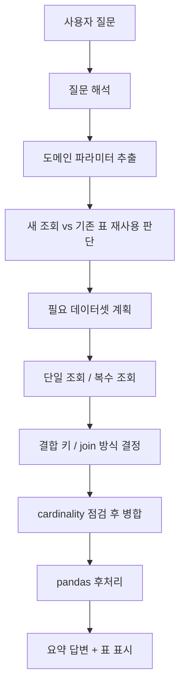
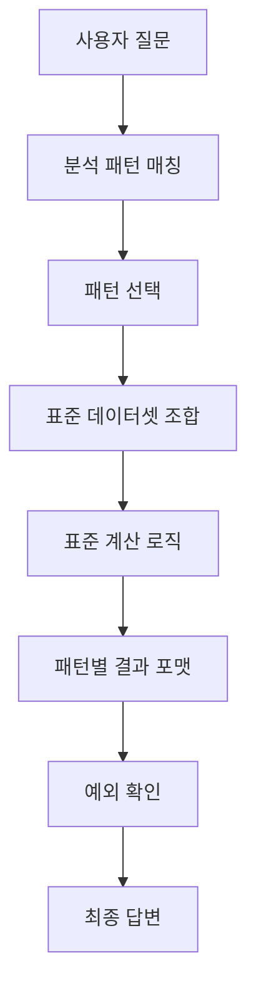
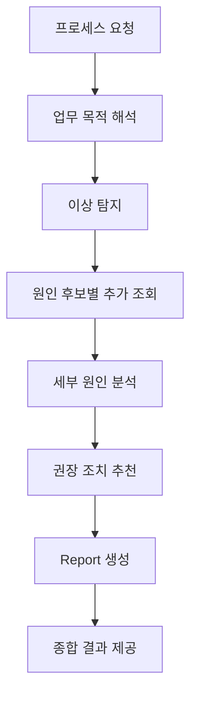

# Manufacturing Agent Slides

이 문서는 발표용 장표 초안입니다.  
슬라이드처럼 읽기 쉽도록 `한 장표 = 한 섹션` 구조로 정리했습니다.

---

## Slide 1. 제조 Agent 과제 개요

### 핵심 메시지

제조 업무는 정형 보고서만 자동화하면 끝나는 문제가 아니라,  
`가변 조회 + 도메인 해석 + 후처리`를 유연하게 처리할 수 있는 Agent 기반 구조가 필요합니다.

### 전달하고 싶은 내용

- 제조 질문은 속성 조합이 계속 달라짐
- 단일 SQL이나 고정 화면으로 끝나지 않는 경우가 많음
- 그래서 먼저 `유연한 분석 기반`이 필요함
- 현재 구현은 그 기반을 만드는 `Phase 1`에 해당함

---

## Slide 2. 현재 제조 업무의 현실

### 핵심 메시지

제조 업무에는 아직 정형화되지 않은 분석성 질문이 많습니다.

### 예시 질문

- `어제 DA공정에서 DDR5제품 생산 달성률 알려줘`
- `오늘 DA공정에서 MODE별 생산량 보여줘`
- `생산 포화율과 생산 달성율을 FAMILY/MODE/DEN/TECH/LEAD 기준으로 보여줘`

### 왜 어려운가

- 질문마다 필요한 테이블이 다름
- 공정/제품/패키지/기술 조건을 도메인적으로 해석해야 함
- 여러 테이블 결합과 pandas 후처리가 자주 필요함

---

## Slide 3. 왜 Manufacturing Agent가 필요한가

### 핵심 메시지

사람이 반복적으로 하던 제조 데이터 조회/분석 과정을 Agent가 대신 수행하도록 만드는 것이 목표입니다.

### Agent가 해야 하는 일

- 질문 해석
- 제조 도메인 인식
- 필요한 데이터셋 선택
- 복수 테이블 결합
- 후처리와 계산
- 결과 설명
- 이후에는 원인 분석과 조치 추천까지 확장

---

## Slide 4. 현재 구현의 의미: Phase 1

### 핵심 메시지

현재 LangGraph 버전은 완성형 보고서 Agent가 아니라,  
`유연 조회와 유연 후처리를 위한 기반 엔진`입니다.

### 현재 Phase 1의 목표

- 자연어 질문을 해석한다
- 필요한 데이터를 유연하게 조회한다
- 복수 테이블을 안전하게 결합한다
- pandas 후처리를 자동 수행한다
- 사용자 도메인 지식을 계속 반영할 수 있게 한다

---

## Slide 5. Phase 1 전체 Agent 흐름

### 핵심 메시지

질문을 바로 SQL로 보내는 구조가 아니라,  
도메인 해석과 분석 단계를 거치는 LangGraph 흐름으로 설계되어 있습니다.

---

## Slide 6. 도메인 지식이 중요한 이유

### 핵심 메시지

제조 Agent는 단순 LLM이 아니라, 도메인 지식을 계속 흡수하는 구조여야 합니다.

### 현재 반영되는 도메인 예시

- 공정 그룹
- 제품/MODE/DEN/TECH/PKG
- 특수 제품 의미
  - HBM/3DS
  - Auto향
- 계산 규칙
  - 달성률
  - 포화율
- join 규칙

### 왜 필요한가

- 질문 표현이 다양함
- 현업 용어가 계속 추가됨
- 계산/판정 로직도 업무에 따라 계속 늘어남

---

## Slide 7. 현재까지 구현된 주요 기능

### 핵심 메시지

Phase 1의 기반 기능은 이미 상당 부분 구현되었습니다.

### 구현 완료 또는 상당 부분 반영된 항목

- 단일/복수 데이터셋 조회
- 파생 지표용 자동 데이터셋 계획
- pandas 후처리
- 연속 질문 처리
- 새 조회 vs 기존 표 재사용 판단 개선
- join rule 등록
- join type 반영
- cardinality 점검
- 도메인 등록/삭제 UI
- 계산 규칙/판정 규칙 등록
- task 기반 모델 라우팅

---

## Slide 8. 지금 해결 중인 핵심 기술 포인트

### 핵심 메시지

현재 단계의 중요한 품질 포인트는 “유연함”과 “안전성”을 동시에 확보하는 것입니다.

### 핵심 이슈

- 새 조회가 필요한데 기존 표를 억지로 재가공하지 않도록 하기
- 복수 테이블 결합 시 N:M 폭증 방지
- 복잡한 질문에서 잘못된 fallback 줄이기
- 쉬운 작업과 어려운 작업에 다른 모델 쓰기
- 사용자 도메인 등록이 실제 실행 흐름에 반영되도록 하기

---

## Slide 9. Phase 2 구상: 반복 업무 패턴화

### 핵심 메시지

자주 반복되는 분석 흐름은 `패턴 Agent` 형태로 정리하는 것이 다음 단계입니다.

### 우선 후보

- 생산 달성률 분석
- 생산 포화율 분석
- 홀드 부하지수 분석
- 설비/재공 복합 이상 분석
- 일자 비교 분석

---

## Slide 10. Phase 3 구상: End-to-End 프로세스 Agent

### 핵심 메시지

정형화 가능한 업무는 “한 번에 끝까지 수행하는 프로세스 Agent”로 확장합니다.

### 생산 이상 분석 예시

- 생산/목표 조회
- 이상 제품 탐지
- 재공/설비/수율/홀드 확인
- 원인 후보 분석
- 권장 조치 생성
- 보고서 생성

---

## Slide 11. 장기 방향: 경험 축적과 플랫폼화

### 핵심 메시지

궁극적으로는 여러 제조 업무 Agent가 연결된 운영 플랫폼으로 발전해야 합니다.

### 장기 방향

- 사례 기반 추천
- 원인-조치 지식 축적
- 유사 문제 검색
- 업무별 Agent 카탈로그
- 권한/운영/배치/리포트 배포 확장

---

## Slide 12. 현재 단계와 다음 우선순위

### 현재 단계 한 줄 정리

현재 LangGraph 버전은 `제조 Agent의 기반 플랫폼을 만드는 Phase 1` 단계입니다.

### 다음 우선순위

1. Phase 1 안정화
2. 반복 패턴 정의
3. Phase 2 패턴 Agent 도입
4. 생산 이상 분석 프로세스 Agent 설계
5. 실제 데이터 연결 준비

### 마무리 메시지

지금은 모든 업무를 한 번에 자동화하는 완성형 Agent를 만드는 단계가 아니라,  
그걸 가능하게 만드는 `기반 구조를 단단하게 만드는 단계`입니다.
